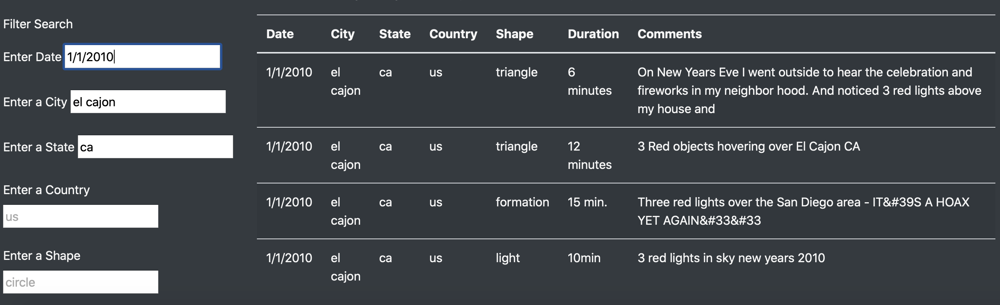

# UFOs
## Overview

The purpose of this dynamic web application is to allow UFO enthusiasts to visit the page and search through or browse recorded UFO sightings in our dataset. We have refactored the code to allow users to search based on city, state, country, and shape, in addition to the recorded date.

## Results

In order to perform a search, a user needs to access this web application (this can be done by opening the index.html file in this repo). We have included an article, *UFO Sightings: Fact or Fancy?*, for light reading. 

Below this article, the user can freely type their search criteria into one or more of the search fields and press the enter key. The filtered results will appear similar to the below image:

## Summary

### Disadvantages
One disadvantage to this page is that it allows the user to free type their search criteria into each field. The data itself is specifically structured and if the user misspells their search criteria, they may not receive the results they are expecting. This is especially apparent in the date field. A date picker could add interest and complexity while eliminating potential user-error while using this search criteria.

### Recommendations
I recommend eliminating as many opportunities as possible for users to freely type in their search criteria. For example, we have a small amount of data for sightings in Canada, however the user might not be considering Canadian sightings in their own research *or* they might not know to use the “ca” country abbreviation to retrieve this data. We can further refine the code for the web application to offer drop-down lists and pickers so that the user is not only able to find exactly what they are looking for, but they can also gain an understanding of all of the recorded sightings through which they can browse.

I would also recommend adding a few more aesthetic details to help break the page up. Because this is a responsive page, the search fields realign when viewed full-screen on a browser versus a smaller screen or minimized window. I would recommend anchoring the search boxes to sit below each corresponding criteria label. I would also format the “Filter Search” header to stand out a bit more. And lastly, I would include a distinct visual break between the article and table and search area to give it a bit more definition.
